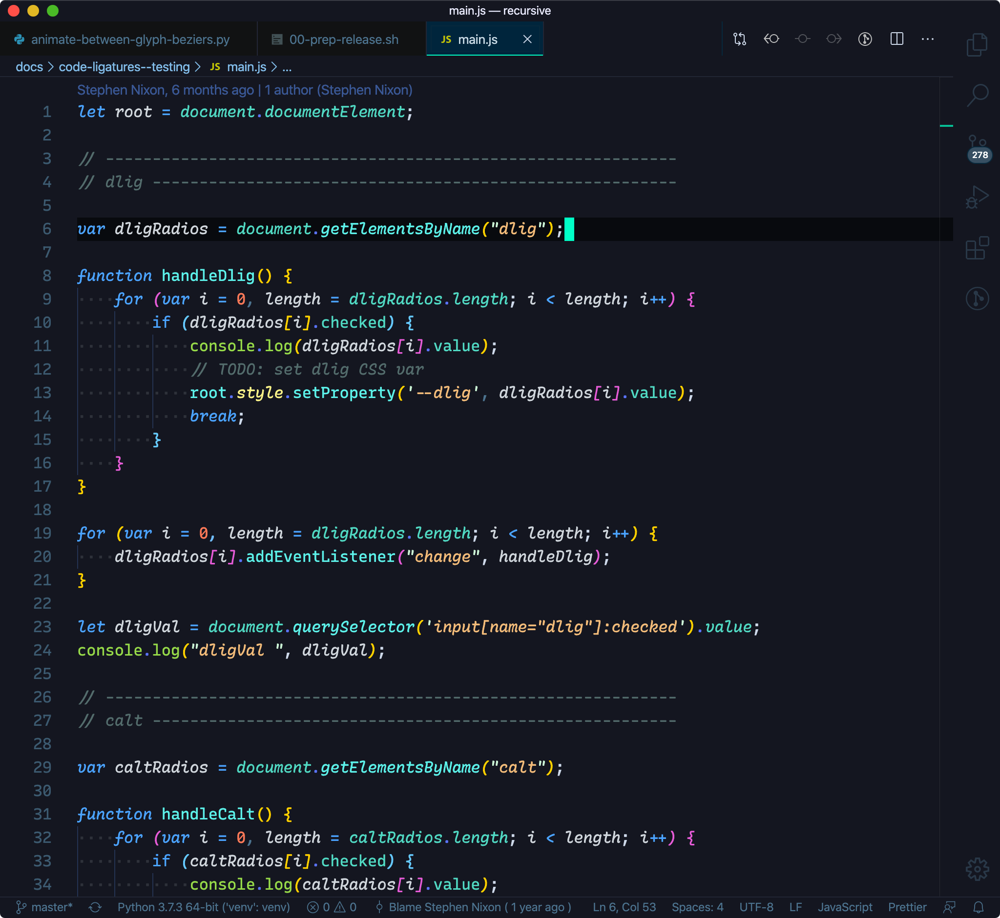

# Recursive theme for VS Code

Made especially for [Recursive Mono](https://github.com/arrowtype/recursive) (or any other code font with nice italics).

## Installation

1. Download this repo as a zip
2. Add the entire folder to `~/.vscode/extensions/`

## Current styling

Note: these screenshots also make use of [Bracket Pair Colorizer](https://marketplace.visualstudio.com/items?itemName=CoenraadS.bracket-pair-colorizer).

## How to start your own theme

**Easiest method**

https://themer.dev/

**More control**

1. duplicate a theme you like within `~/.vscode/extensions/`
2. update package.json
3. update colors in `themes/________theme.json`

## How to determine the type of a given token

It’s critical to be able to determine type of a given token in order to become efficient in theming. Luckily, it's easy!

> Trigger the scope inspector from the Command Palette with the `Developer: Inspect Editor Tokens and Scopes` [source](https://code.visualstudio.com/api/language-extensions/syntax-highlight-guide#scope-inspector)
